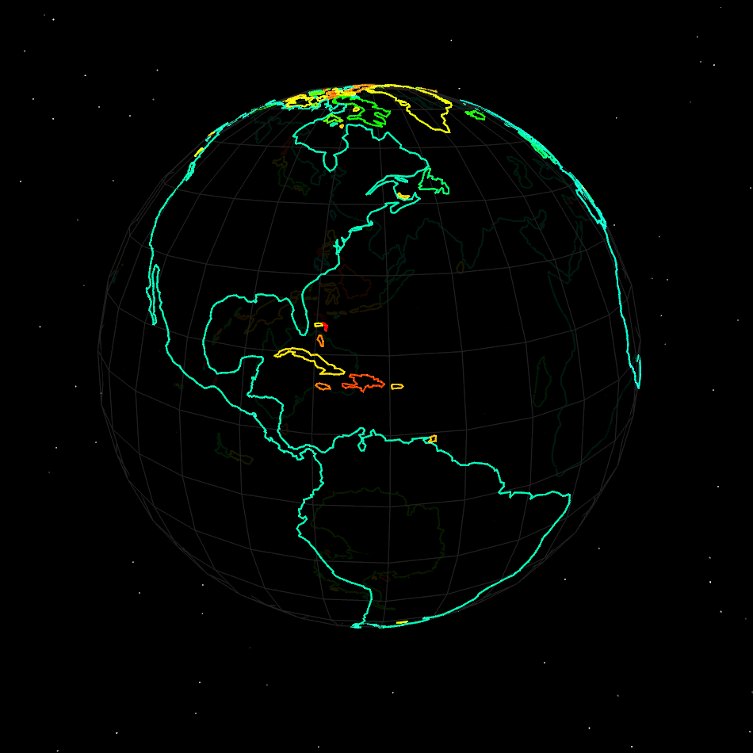

# 3D Globe with Three.js

A simple Three.js app that renders a 3D globe, with a sweet starfield.



## Features

- **Interactive 3D Globe**: Rotate and zoom the globe using orbit controls.
- **Country Outlines**: Visualizes feature borders using GeoJSON data.
- **Starfield Background**: Enhances the visual experience with a starfield effect.

Watch the tutorial on [YouTube](https://youtu.be/f4zncVufL_I)

## Installation
Ensure you have a local development server (such as `live-server` or `http-server`) to serve your files.

```sh
# Clone the repository
git clone https://github.com/bobbyroe/threejs-webgpu-template.git
cd threejs-webgpu-template
```

## Usage
Run a local server to serve the project:

```sh
npx http-server
```
or fire up Live Server
## Data Sources

- **GeoJSON Data**: Country outlines are sourced from [Natural Earth GeoJSON](https://github.com/martynafford/natural-earth-geojson).
- **Additional Datasets**: For more datasets, visit [Natural Earth Data](https://www.naturalearthdata.com/downloads/).

## License
This project is licensed under the MIT License.

## Acknowledgments

- **Three.js**: [threejs.org](https://threejs.org/)
- **Natural Earth Data**: [naturalearthdata.com](https://www.naturalearthdata.com/)